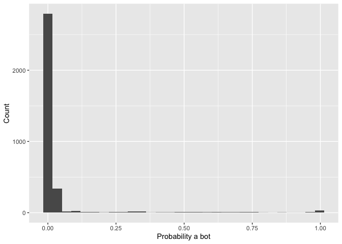

# Week 9: Collecting Twitter protest data

In this tutorial, you will learn how to:

* Get developer access credentials to Twitter
* Use the <tt>rtweet</tt> package to query the Twitter API
* Collect different types of data on protest

NOTE: if you already went through the sections on setting up developer access to Twitter in Week 7 then you can skip the first "Setup" and "Load data and packages" sections.

## Setup 

To practice these skills, you might want to create a new account for your academic research. But you needn't create a new account to follow the steps below. You can simply use your own account---if you have one---as using the developer tools will not change anything about your public Twitter account. 

{width=100%}

##  Load data and packages 

Before proceeding, we'll load the remaining packages we will need for this tutorial.


```r
library(tidyverse) # loads dplyr, ggplot2, and others
library(rtweet) # to query the Twitter API in R
```

Once you've create your new account, or have logged into your existing one, go to the Twitter developer portal log in page [here](https://developer.twitter.com/en).

Click on Apply in the navigation bar on the top right of the page. You'll be asked "what best describes you?" For the purposes of this tutorial, select academic, and then select student. Fill in all the relevant information and submit your application. Your application will then be reviewed by Twitter before access is granted. This might take hours or days.

Once you have authorization, a new tab will appear in the navigation bar at the top of the develop portal, as below:

{width=100%}

Navigate to the developer portal and you will there be able to create a new "app" to query the API. You see in my account that I have several apps for different purposes.

{width=100%}
We can create a new app on this Overview page too. When we click "Create App" we will first be asked to name the app. Most importantly, we will then be given an "API key"; an "API secret key"; and a "Bearer token" as below.

{width=30%}

You **MUST** make a record of these. Once you have done so, you can then use these to access the API. Once you have recorded these, navigate to the App setting tabs for the App you've created now listed in the Overview tab on the left hand side navigation window.

{width=50%}

Navigate to "Keys and tokens" on this page, and click generate in the Access token & secret box as below:

{width=50%}

Record these as well. Once you have all of these keys and tokens recorded somewhere safe, you are ready to collect data!


## Querying the Twitter API with <tt>rtweet</tt>

This is pretty simple using the <tt>rtweet</tt> package. Below, we'll collect the last 5000 tweets using the #BLM and #BlackLivesMatter hashtags. 

The tweets you collect will look different to those you see below, which were pre-collected for the purposes of this exercise.


```r
api_key <-" XXXXXXXXXXXXXXXXXXXXXXX"
api_key_secret <- "XXXXXXXXXXXXXXXXXXXXXXXXXXXXXXXXXXXXXXXXXXXXXXXXXX"
access_token <- "XXXXXXXXXXXXXXXXXXXXXXXXXXXXXXXXXXXXXXXXXXXXXXXXXX"
access_token_secret <- "XXXXXXXXXXXXXXXXXXXXXXXXXXXXXXXXXXXXXXXXXXXXXX"

token <- create_token(
  app = "NAME YOUR APP",
  consumer_key = api_key,
  consumer_secret = api_key_secret,
  access_token = access_token,
  access_secret = access_token_secret
)

BLMtweets <- search_tweets("#BLM OR #BlackLivesMatter", 
                           n = 5000, include_rts = FALSE)
```

Once you have entered your keys, tokens, and key/token secrets, store them with the `create_token()` function. Here, we are collecting the last 5000 tweets for the hashtags #BLM and #BlackLivesMatter, though you can change this by specifying a higher n---be aware, though, that you will encounter rate limits after a time. 

<table class="table table-striped table-hover table-condensed table-responsive" style="margin-left: auto; margin-right: auto;">
 <thead>
  <tr>
   <th style="text-align:left;"> created_at </th>
   <th style="text-align:left;"> screen_name </th>
   <th style="text-align:left;"> text </th>
  </tr>
 </thead>
<tbody>
  <tr>
   <td style="text-align:left;"> 2021-03-12 09:47:23 </td>
   <td style="text-align:left;"> photowarrior </td>
   <td style="text-align:left;"> While Social Housing shortage, poverty &amp;amp; homelessness worsen, Mayor Helps peers cruelly plan to cancel 24/7 camping; ban sleeping* in cars

*initiative led by #BLM protest critics #StevilAndrew &amp;amp; racist #CharlayneCopSplain, who HATES indigenous flags on KKKanada Day. #bcpoli https://t.co/8w1xBuLI2l </td>
  </tr>
  <tr>
   <td style="text-align:left;"> 2021-03-12 09:46:33 </td>
   <td style="text-align:left;"> zoranhorus </td>
   <td style="text-align:left;"> So #BLM activism is dangerous for democracy, constitutionality and it will bring more diversity in the society it's a form of racism. Destroying a culture to create a new culture and they call it the good side of history. </td>
  </tr>
  <tr>
   <td style="text-align:left;"> 2021-03-11 23:19:17 </td>
   <td style="text-align:left;"> zoranhorus </td>
   <td style="text-align:left;"> Oh yes you #BLM when Trump, Israel attacked former prosecutor Fatou Bensoud I was the only one publicly standing in her defense even though I knew I would lose credits with both the US and Israel ... I didn’t hear #cnn stand in her defense? </td>
  </tr>
  <tr>
   <td style="text-align:left;"> 2021-03-12 09:46:18 </td>
   <td style="text-align:left;"> Concern01277727 </td>
   <td style="text-align:left;"> Companies painting BLM on their businesses is just like the Israelites smearing lambs blood over their door posts... #BLM 
☻ </td>
  </tr>
  <tr>
   <td style="text-align:left;"> 2021-03-11 23:16:23 </td>
   <td style="text-align:left;"> BotDefund </td>
   <td style="text-align:left;"> Defund the New Cumberland Police #BlackLivesMatter #DefundThePolice </td>
  </tr>
  <tr>
   <td style="text-align:left;"> 2021-03-11 12:16:21 </td>
   <td style="text-align:left;"> BotDefund </td>
   <td style="text-align:left;"> Defund the Anaheim Police #BlackLivesMatter </td>
  </tr>
  <tr>
   <td style="text-align:left;"> 2021-03-11 19:16:43 </td>
   <td style="text-align:left;"> BotDefund </td>
   <td style="text-align:left;"> Defund the Collegeville Police #BlackLivesMatter #DefundThePolice </td>
  </tr>
  <tr>
   <td style="text-align:left;"> 2021-03-12 09:46:15 </td>
   <td style="text-align:left;"> BotDefund </td>
   <td style="text-align:left;"> Defund the Cairo Police #BlackLivesMatter </td>
  </tr>
  <tr>
   <td style="text-align:left;"> 2021-03-12 06:16:23 </td>
   <td style="text-align:left;"> BotDefund </td>
   <td style="text-align:left;"> Defund the #TrinityPolice #BlackLivesMatter </td>
  </tr>
  <tr>
   <td style="text-align:left;"> 2021-03-11 12:46:20 </td>
   <td style="text-align:left;"> BotDefund </td>
   <td style="text-align:left;"> Defund the Hagerstown Police #BlackLivesMatter #DefundThePolice </td>
  </tr>
</tbody>
</table>

As the documentation of the <tt>rtweet</tt> package notes: "To return more than 18,000 tweets in a single call, users must set `retryonratelimit` argument to true... As a result, it is possible to search for 50,000, 100,000, or even 10,000,000 tweets, but these searches can take hours or even days."

Here, we have set include retweets to FALSE meaning that all of our tweets are original tweets rather than retweets. It seems that we have some bot accounts in our data. Let's see if we can predict how many of these accounts are bots. First we need to install a package called <tt>tweetbotornot2</tt>


```r
## install {remotes} if not already
if (!"remotes" %in% installed.packages()) {
  install.packages("remotes")
}

library(remotes)
remotes::install_github("mkearney/tweetbotornot2")
```

Once we've loaded this package we can use the function `predict_bot()` to estimate what proportion of these accounts are bot accounts.


```r
library(tweetbotornot2)
botp <- predict_bot(BLMtweets)

ggplot(botp) +
  geom_histogram(aes(prob_bot)) +
  labs(x= "Probability a bot", y= "Count")
```


```
## `stat_bin()` using `bins = 30`. Pick better value with `binwidth`.
```

<!-- -->

From the histogram it seems that the proportion of overall tweets from bots (i.e., counts of accounts with high probability) is low. You can read more about this function [here](https://github.com/mkearney/tweetbotornot2), which also contains information on how bot identities are predicted, as well as how much we can trust these predictions.

You can also play around with the different API calls possible with the <tt>rtweet</tt> package. See the full documentation [here](https://cran.r-project.org/web/packages/rtweet/rtweet.pdf) and [here](https://github.com/ropensci/rtweet).

And for those interested, you can access a development version of a package to collect tweets from the Academic Research Product Track API [here](https://github.com/cjbarrie/academictwitteR). I am working on this with a colleague. It is working at the moment but needs some refinement.

Getting access to the Academic Research Product Track is a bit more complicated but for more information on how to apply see [here](https://developer.twitter.com/en/solutions/academic-research/products-for-researchers). 

## References
