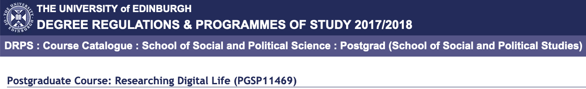

# RDL-Edinburgh

This repo contains teaching materials for a four lecture series in Researching Digital Life core course, University of Edinburgh. 

You can use this in several ways:

1. You might want to "clone" the entire repository and save all of the files in here locally. That's fine if you know how to navigate the different file types contained in here. 
2. You can use the quick links below to access online versions of the content, which are more easily accessible. I suggest you then copy and paste code snippets from the online documents into your own .R scripts.

## Quick links for each week

- Introduction: \[[Link](https://raw.githack.com/cjbarrie/RDL-Ed/main/01-intro/01-intro.html)\]
- Week 6 Exercise: Text as data \[[Link](https://raw.githack.com/cjbarrie/RDL-Ed/main/02-text-as-data/02-week6.html)\]

